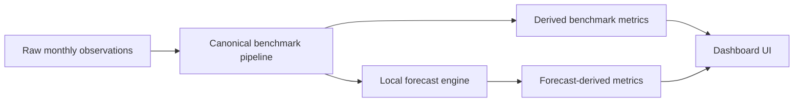

# Benchmark Dashboard

## Overview

Benchmark Dashboard is a portfolio-grade benchmark intelligence dashboard that turns raw monthly revenue and traffic observations into market-share analysis, rankings, monetization diagnostics, period aggregation, and local scenario forecasts.

The public demo is intentionally synthetic. It contains five full years of monthly observations (480 raw rows: 8 companies x 60 months), no real company data, no private client data, no credentials, and no required paid API.

## Live Demo

Live demo: _add deployment URL after release_

Screenshots:

<!-- Add screenshot: dashboard overview -->
<!-- Add screenshot: market share / ranking section -->
<!-- Add screenshot: company profile -->
<!-- Add screenshot: forecast section -->

See [docs/screenshot-checklist.md](docs/screenshot-checklist.md) for the capture list.

## What It Does

- Loads raw monthly observations from `public/data/benchmark-data.json` or an optional API.
- Preserves legacy `data.interface` compatibility for older enriched payloads.
- Derives benchmark metrics in code: tracked benchmark-set share, ranks, growth, indexed values, revenue per visit, and monetization gap.
- Aggregates monthly observations into annual or custom periods without averaging percentages.
- Generates local scenario forecasts from observed revenue and visits.
- Renders an executive-style dashboard with rankings, market share, profiles, and forecast views.

## What Makes It Different

This is not a static chart demo. The dashboard keeps source data raw and moves benchmark intelligence into a canonical framework pipeline. That makes the repo easier to audit, safer to publish, and reusable with custom data.



## Architecture

| Layer | Responsibility |
| --- | --- |
| `public/data/benchmark-data.json` | Synthetic raw monthly demo observations |
| `src/framework/core/buildCanonicalBenchmarkPayload.js` | Single canonical entry point for raw and legacy payloads |
| `src/framework/core/` | Benchmark derivation, synthetic benchmark rows, aggregation, coverage metadata |
| `src/framework/forecasting/` | Provider-based forecast generation with local engine default |
| `src/lib/api.js` | Loads JSON/API data and delegates to the canonical pipeline |
| `src/App.jsx` | Dashboard shell and UI composition |
| `src/features/` | Extracted battle, forecast, and profile helper logic |

## Data Pipeline

Preferred source shape:

```json
{
  "ok": true,
  "data": {
    "source_monthly": [
      {
        "date": "2025-01-01",
        "company_id": "focus",
        "display_name": "Focus Brand",
        "market": "Demo Market",
        "type": "own",
        "revenue": 125000,
        "visits": 82000
      }
    ]
  }
}
```

The public JSON stores raw monthly rows only. The current demo covers 2021-01-01 through 2025-12-01 for 8 synthetic companies. It does not store forecast rows, synthetic `market_total` / `market_average` rows, tracked-share fields, rank fields, indexed fields, or growth fields. Those are generated by the framework.

Read the full contract in [docs/data-contract.md](docs/data-contract.md), then use [docs/quickstart-custom-data.md](docs/quickstart-custom-data.md) to connect your own dataset.

## Forecast Engine

The default forecast provider is `local_engine`. It is a local statistical forecast engine for scenario projections, not a guarantee of future performance.

The local engine:

- Uses observed monthly `revenue` and `visits`.
- Generates conservative, base, and aggressive scenarios.
- Requires no Python service, model weights, paid API, or network request.
- Sends forecast rows back through the same derived-metrics pipeline as actual rows.

TimesFM is optional advanced infrastructure only. If `VITE_TIMESFM_API_URL` is not configured, the dashboard uses the local engine.

## Getting Started

```bash
pnpm install
pnpm generate:data
pnpm dev
```

Open the local Vite URL shown by the dev server.

## Scripts

```bash
pnpm test
pnpm generate:data
pnpm build
pnpm validate:data
pnpm audit:public
pnpm typecheck
pnpm lint
```

`lint` and `typecheck` are configured for this repo. If dependency linking is unavailable in your environment, the framework tests can also be run directly with `node --test tests/*.test.js`.

## Deployment

No environment variables are required for the public static demo.

For Vercel or another static host:

```bash
pnpm install
pnpm test
pnpm build
pnpm validate:data
pnpm audit:public
```

Deploy the generated `dist/` output.

See [DEPLOYMENT.md](DEPLOYMENT.md) for Vercel, optional API, optional TimesFM, and rollback notes.

## Privacy & Public Data

The demo dataset is synthetic and designed for public inspection.

- No real company performance data.
- No private client names.
- No personal data.
- No credentials or API keys.
- No required backend.
- No required TimesFM service.
- 480 raw monthly observations: 8 synthetic companies x 60 months.
- Forecast rows, benchmark rows, seasonality, YoY metrics, and tracked benchmark-set share are generated at runtime.

## Limitations

- Forecasts are scenario projections from a local statistical engine.
- The demo data is synthetic and should not be interpreted as market research.
- The app is a static portfolio demo, not a production analytics platform.
- Optional live APIs must implement the documented data contract.

## Roadmap

- Add public deployment URL and real screenshots.
- Add more visual regression coverage for key dashboard states.
- Continue extracting pure helpers from `src/App.jsx` without changing UI behavior.
- Add optional hosted examples for custom data payloads.

## Portfolio Notes

Case study draft: [docs/portfolio-case-study.md](docs/portfolio-case-study.md)

Public release checklist: [docs/public-release-checklist.md](docs/public-release-checklist.md)
