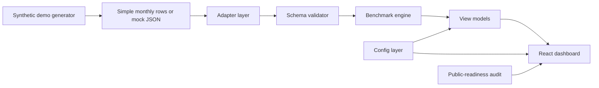

# Benchmark Intelligence Framework


Reusable benchmark dashboard framework for competitive intelligence, executive reporting, and market-performance storytelling.

`benchmark_dashboard` is not just a static dashboard. It is structured as a small frontend framework: data contract, adapters, validation, benchmark calculations, view models, configuration, and a polished React interface.

The goal is simple:

> Turn monthly business data into a reusable benchmark intelligence surface without hiding the logic inside React components.

This repository uses synthetic/mock public data only. No real company, client, competitor, or market data is included.

---

## Why this exists

Most portfolio dashboards look good but are hard to reuse.  
Most BI tools are powerful but too heavy for fast strategic prototypes.

This project sits between both:

- polished enough to present
- structured enough to reuse
- simple enough to configure
- explicit enough to test
- safe enough to publish with mock data

It is designed for scenarios where a team needs to quickly turn market, traffic, revenue, or competitor data into a clean executive-facing interface.

---

## What it does

- Loads benchmark data from a static JSON snapshot or optional API endpoint.
- Validates benchmark payloads against an explicit data contract.
- Converts simple monthly rows into enriched benchmark payloads.
- Calculates market share, growth, ranks, revenue per visit, and efficiency metrics.
- Builds chart/table-ready view models outside React components.
- Renders a polished dashboard with benchmark comparisons and market intelligence views.
- Supports synthetic public demo data generation.
- Includes public-readiness checks to avoid leaking private files or references.
- Keeps customization centralized through config files instead of hardcoded UI edits.

---

## What it is not

This project is intentionally scoped.

It is **not**:

- a full BI platform
- a backend analytics warehouse
- a private-data connector
- a real-time market intelligence system
- a generic no-code dashboard builder
- a replacement for Tableau, Looker, Power BI, or Hex
- a production data governance system

It is a framework-ready frontend dashboard template for portfolio-safe benchmark intelligence demos and lightweight internal prototypes.

---

## System architecture



---

## Architecture layers

| Layer | Path | Responsibility |
|---|---|---|
| Schema | `src/framework/schema/` | Validates benchmark payloads and reports warnings/errors |
| Core engine | `src/framework/core/` | Pure functions for market share, growth, ranks, efficiency, aggregation |
| Adapters | `src/framework/adapters/` | Converts source rows into benchmark-ready payloads |
| View models | `src/framework/view-models/` | Prepares chart/table-ready objects outside React |
| Config | `src/framework/config/defaultBenchmarkConfig.js` | Centralizes labels, defaults, metrics, theme, and view switches |
| Dashboard | `src/App.jsx` | React UI, controls, layout, and Recharts rendering |
| Scripts | `scripts/` | Demo data generation, data validation, public-readiness audit |

The key design choice is separation of concerns:

> Data logic lives in the framework layer.  
> Presentation logic lives in the dashboard layer.

---

## Data flow

```txt
source rows
  -> adapter
  -> normalized benchmark payload
  -> schema validation
  -> benchmark calculations
  -> view model generation
  -> React dashboard rendering
```

This keeps the dashboard configurable without turning `App.jsx` into a pile of one-off calculation logic.

---

## Data contract

The dashboard accepts an enriched benchmark payload:

```json
{
  "ok": true,
  "meta": {},
  "data": {
    "interface": [],
    "events": [],
    "dictionary": []
  }
}
```

`data.interface` is the source of truth.

### Required row fields

| Field | Meaning |
|---|---|
| `date` | Period date in `YYYY-MM-DD` format |
| `period_type` | Usually `monthly`, `quarterly`, or `annual` |
| `company_id` | Stable entity ID |
| `display_name` | UI label |
| `type` | Usually `competitor` or `benchmark` |
| `market` | Market/filter label |
| `revenue` | Numeric revenue value or `null` |
| `visits` | Numeric visit value or `null` |
| `data_type` | `actual`, `estimated`, or `forecast` |

### Optional enriched fields

- `market_share_revenue`
- `market_share_visits`
- `revenue_yoy_growth`
- `visits_yoy_growth`
- `revenue_mom_growth`
- `visits_mom_growth`
- `rank_revenue`
- `rank_visits`
- `revenue_per_visit`
- `revenue_share_vs_visit_share`
- `indexed_revenue`
- `indexed_visits`
- `forecast_scenario`
- `active`
- `color`
- `logo`
- event fields such as `event_summary`, `event_names`, `event_type`, `expected_impact`

See [`docs/data-contract.md`](docs/data-contract.md) for the full contract.

---

## Simple monthly input

For the fastest setup, start with simple monthly rows:

```json
[
  {
    "date": "2026-01-01",
    "company_id": "brand_a",
    "display_name": "Brand A",
    "market": "Demo Market",
    "revenue": 125000,
    "visits": 82000
  }
]
```

Then convert them with:

```js
adaptSimpleMonthlyRows()
```

The adapter enriches the rows with:

- default period metadata
- revenue and visit market share
- MoM growth when prior periods exist
- YoY growth when prior-year periods exist
- revenue and visit ranks
- revenue per visit
- revenue share vs visit share

---

## Benchmark engine

The framework layer calculates common competitive intelligence metrics.

| Metric | Purpose |
|---|---|
| Revenue market share | Measures share of total market revenue |
| Visit market share | Measures share of total market traffic |
| MoM growth | Shows month-over-month movement |
| YoY growth | Shows year-over-year movement |
| Revenue rank | Ranks companies by revenue |
| Visit rank | Ranks companies by traffic |
| Revenue per visit | Approximates monetization efficiency |
| Revenue share vs visit share | Compares commercial capture against traffic capture |
| Indexed revenue / visits | Supports relative trend visualization |
| Forecast scenario | Supports estimated or projected periods |

All core calculations should remain pure, testable, and independent from React.

---

## Public demo data policy

This repository intentionally uses synthetic/mock data only.

Do **not** commit:

- private company data
- client data
- competitor exports
- market research exports
- private screenshots
- delivery ZIP files
- `.env.local`
- real API URLs with secrets
- `node_modules`
- `dist`
- machine-specific paths
- private CSV/Excel exports

The public demo snapshot lives at:

```txt
public/data/benchmark-data.json
```

Regenerate it with:

```bash
pnpm demo:data
```

Before publishing, run:

```bash
pnpm validate:data
pnpm audit:public
```

---

## Configuration

Most first-pass customization belongs in:

```txt
src/framework/config/defaultBenchmarkConfig.js
```

Use it to change:

- dashboard title
- dashboard subtitle
- currency
- locale
- default market
- default metric
- own company ID
- benchmark company ID
- metric labels
- enabled views
- theme tokens
- chart defaults

This keeps the dashboard adaptable without requiring deep edits across the React UI.

---

## Using your own data

There are two supported paths.

### Option 1: Simple monthly rows

Best for fast prototypes.

1. Prepare rows with `date`, `company_id`, `display_name`, `market`, `revenue`, and `visits`.
2. Pass them through `adaptSimpleMonthlyRows()`.
3. Validate the output.
4. Render the dashboard.

### Option 2: Enriched benchmark payload

Best for advanced integrations.

1. Produce the full benchmark payload from your own backend or data process.
2. Match the contract in `docs/data-contract.md`.
3. Replace `public/data/benchmark-data.json` or set `VITE_BENCHMARK_API_URL`.
4. Run validation and tests.

```bash
pnpm validate:data
pnpm test
pnpm build
```

---

## API/data loading model

By default, the app loads:

```txt
public/data/benchmark-data.json
```

If this environment variable is set:

```txt
VITE_BENCHMARK_API_URL
```

the app tries that endpoint first and falls back to the local public snapshot.

This makes the repo useful both as:

- a static portfolio demo
- a frontend shell for a future data-backed benchmark product

---

## Adapter pattern

Adapters convert source formats into the benchmark payload contract.

Current adapter:

```txt
src/framework/adapters/simpleMonthlyAdapter.js
```

Adapter checklist:

- Do not mutate source rows.
- Normalize dates to `YYYY-MM-DD`.
- Keep `company_id` stable across periods.
- Preserve existing enriched metrics unless recalculation is intentional.
- Validate before rendering.
- Use synthetic/mock data for public demos.
- Run tests after adapter changes.

See [`docs/adapter-guide.md`](docs/adapter-guide.md).

---

## Tech stack

| Layer | Technology |
|---|---|
| Frontend | React |
| Build tool | Vite |
| Styling | Tailwind CSS |
| Charts | Recharts |
| Language | JavaScript / ES Modules |
| Testing | Node test runner |
| Package manager | pnpm |
| Data source | Static JSON or optional API endpoint |

---

## Repository structure

```txt
src/
  framework/
    adapters/       Source-data adapters
    config/         Dashboard defaults and customization
    core/           Pure benchmark calculation functions
    schema/         Payload validation
    view-models/    Chart/table-ready data builders

  lib/              API/data loading helpers
  App.jsx           Dashboard UI
  main.jsx          React entry

public/
  data/
    benchmark-data.json

scripts/
  generate-demo-data.mjs
  validate-data.mjs
  audit-public-ready.mjs

tests/
  benchmark calculation and validation tests

docs/
  framework-overview.md
  data-contract.md
  adapter-guide.md
  mock-data-policy.md
  roadmap.md
```

---

## Local setup

### Install

```bash
pnpm install
```

### Run dev server

```bash
pnpm dev
```

### Build

```bash
pnpm build
```

### Preview production build

```bash
pnpm preview
```

---

## Scripts

| Script | Purpose |
|---|---|
| `pnpm dev` | Start Vite dev server |
| `pnpm build` | Build the static dashboard |
| `pnpm preview` | Preview production build |
| `pnpm test` | Run benchmark calculation and validation tests |
| `pnpm test:watch` | Run tests in watch mode |
| `pnpm validate:data` | Validate `public/data/benchmark-data.json` |
| `pnpm demo:data` | Regenerate seeded synthetic demo data |
| `pnpm audit:public` | Scan for private paths, private references, and forbidden artifacts |
| `pnpm prepublish:public` | Regenerate demo data, build, and run public-readiness audit |

---

## Public-readiness workflow

Before publishing or deploying:

```bash
pnpm demo:data
pnpm validate:data
pnpm test
pnpm build
pnpm audit:public
```

This checks that:

- demo data is synthetic
- benchmark data validates against the expected shape
- calculations still pass tests
- the app builds
- forbidden private artifacts or references are not present

---

## Documentation

| Document | Purpose |
|---|---|
| [`docs/framework-overview.md`](docs/framework-overview.md) | Explains the reusable architecture layers |
| [`docs/data-contract.md`](docs/data-contract.md) | Defines the benchmark payload shape |
| [`docs/adapter-guide.md`](docs/adapter-guide.md) | Explains how to connect new data sources |
| [`docs/mock-data-policy.md`](docs/mock-data-policy.md) | Defines public-safe data rules |
| [`docs/roadmap.md`](docs/roadmap.md) | Lists planned improvements |

---

## Current limitations

- Uses synthetic demo data only.
- No backend database is included.
- No authentication or user accounts.
- No built-in private data connector.
- No CSV upload UI yet.
- No automated CI workflow yet.
- No live data refresh scheduler.
- No row-level data governance system.
- Forecasts and events are demo-oriented unless connected to a real source.
- The current framework is frontend-first and best suited for static demos or lightweight internal prototypes.

---

## Portfolio relevance

This project demonstrates:

- analytics product design
- reusable frontend architecture
- explicit data contracts
- adapter-based data ingestion
- benchmark calculation logic
- validation-first dashboard development
- synthetic public demo safety
- executive intelligence UX
- framework-oriented project structuring

The value of the project is not only the dashboard UI.

The value is the transformation from a one-off visual dashboard into a reusable benchmark intelligence framework with clear data boundaries, calculation logic, and public-safe demo infrastructure.

---

## License

MIT. See [`LICENSE`](LICENSE).
